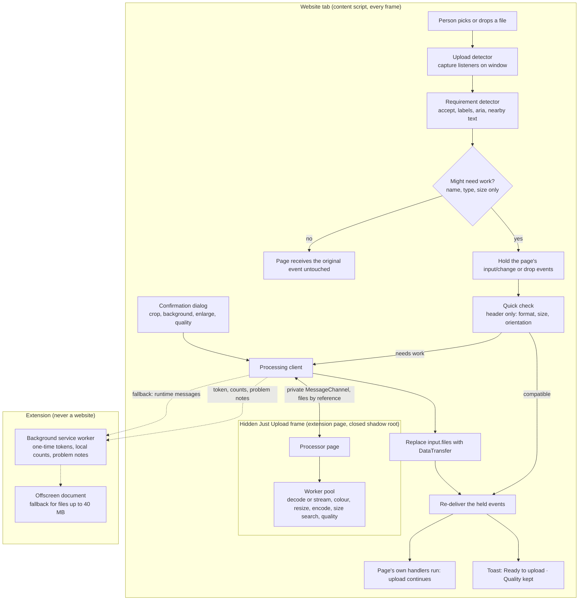

# Just Upload

**Upload any image. We make it work.**

Just Upload is a browser extension that makes uploads work on websites that are picky
about format, file size or dimensions: images, PDFs, and CSV or Excel files. You pick a
file the way you always do. If
the website can take it as it is, nothing happens. If it can't, Just Upload prepares a
compatible copy on your device, before the website ever sees the original, and the
upload carries on.

```text
I chose a file.  →  It worked.
```

It is not an image converter or a compression dashboard. There is nothing to learn and
nothing to configure.

## What it does

| You pick                   | The website wants                              | What happens                                                                              |
| -------------------------- | ---------------------------------------------- | ----------------------------------------------------------------------------------------- |
| `vacation.webp`, 2.7 MB    | JPG or PNG, maximum 2 MB                       | Converted to a 1.9 MB JPG at full size, keeping 97%, automatically                        |
| `Screenshot.png`, 2.3 MB   | Attachments up to 1 MB                         | Saved as a 781 KB JPG at full size, keeping 99%, automatically                            |
| `scan.tif`, 26.1 MB        | JPG only, maximum 2 MB                         | Converted to a 1.9 MB JPG at full size, keeping 98%, automatically                        |
| `IMG_2041.HEIC`, 1.6 MB    | JPG only, maximum 1 MB                         | Converted to a 942 KB JPG at full size, keeping 97%, automatically                        |
| `photo.webp`               | `accept="image/jpeg,image/png"`                | Converted to JPG, automatically                                                           |
| A 4032 × 3024 photo        | Maximum 1920 × 1920                            | Resized to 1920 × 1440, automatically                                                     |
| A 24 MP camera JPG, 8.2 MB | File size should not exceed 2 MB               | Made smaller to 1.8 MB at its full 6000 × 4000, automatically                             |
| A phone photo, 1.6 MB      | Max 500 KB                                     | Asks first: 96% of the photo's quality would be kept                                      |
| A 48 MP phone JPG, 9.4 MB  | Max 1 MB                                       | **Left as it is**, with a note: it can't fit without fewer pixels                         |
| `photo.jpg`, 900 KB        | JPG or PNG, max 2 MB                           | **Nothing.** No delay, no message                                                         |
| A portrait photo           | Square 600 × 600                               | Asks you to choose the crop first                                                         |
| A transparent PNG          | JPG only                                       | Asks before filling the background with white                                             |
| `logo.svg`                 | PNG only                                       | Drawn sharp as `logo.png`, automatically                                                  |
| A 4.6 GB BigTIFF scan      | JPG or PNG, up to 1920 × 1920 pixels           | Read in a stream and saved as a 1920 × 1824 JPG                                           |
| A photo                    | "Please save your file as a TIFF"              | Converted to TIFF, automatically                                                          |
| Any photo                  | Favicon, `.ico` only                           | Made into a 256 × 256 `.ico`, automatically                                               |
| A photo                    | GIF only                                       | Asks first: GIF can show only 256 colours                                                 |
| A 0.9 KB PNG signature     | File size: minimum 30 KB, maximum 1 MB         | Brought up to 31 KB with the same pixels, automatically                                   |
| A phone photo              | JPG, 200 × 230 pixels, between 20 KB and 50 KB | Asks where to crop, then a 200 × 230 JPG of 20 KB                                         |
| A photo or scan            | PDF only, max 300 KB                           | Put on an A4 page as a one-page PDF, full size, automatically                             |
| A scanned PDF, 2 MB        | PDF, max 1 MB                                  | Made smaller to 957 KB by saving its pictures at lower quality (97% kept); text untouched |
| `certificate.pdf`          | JPG or PNG only                                | Its page drawn as a JPG; asks first if the PDF has several pages                          |
| `contacts.xlsx`            | CSV files only                                 | Saved as CSV; asks which sheet if the workbook has several                                |
| `contacts.csv`             | Excel workbook (.xlsx) only                    | Saved as XLSX; codes like 00123 keep their zeros                                          |

This works whether you choose the file with the site's button or drag it onto the site's
upload area.

Anything that changes how an image looks (cropping, removing transparency, flattening an
animation, enlarging, or a size limit that would cost visible quality) is always a
question, never a surprise. Every note says how much of the photo's quality was kept,
for example "WebP → JPG · Quality kept: 97%". If something cannot be prepared safely, the
website gets your original file, exactly as if Just Upload were not installed.

**Your photo keeps its pixel size unless the website states one, or you agree.** A
file-size limit is met with quality first. Only if no quality can get a photo (or a PDF's
pictures) under the limit at full size does Just Upload find the largest smaller size
that fits, and ask before using it: "This image can't fit 500 KB at full size. To fit, it
needs fewer pixels: 6000 × 4000 → 2926 × 1951. It keeps 95% of its quality." Declining
gives the website your original. A file under a site's minimum size is saved in more
detail and, if that is not enough, padded with bytes image readers skip.

**Rules are read the way websites write them**: "Max. 2 MB", "File size should not exceed
500KB", "Image upto 2MB", "File size: 20KB - 50KB", "Image size must be at least 50 KB",
"Up to 1920 × 1920 pixels", "JPG only, no PNG" and the other phrasings in
[tests/unit/wording.test.ts](tests/unit/wording.test.ts), 141 in all. A total for the
whole form ("Total upload size must not exceed 20 MB") is not a limit for one image.

### How "quality kept" is measured

The prepared image is compared with your photo using structural similarity (SSIM, the
standard measure of how alike two images look), at the size a screen shows them: up to
3000 pixels on the long side. Shrinking that the website's own pixel rules require does
not count against it, because the site asked for it. 100% means the copy is identical
(for example a lossless PNG), and 97% or more looks the same to the eye. With the
default setting, Just Upload asks before uploading anything below 97% because of a
size limit.

## How fast it is

Measured with the extension on and off (`tests/e2e/latency.spec.ts`, which also enforces
these as budgets):

| You pick                                                                | Delay Just Upload adds |
| ----------------------------------------------------------------------- | ---------------------- |
| An image the site accepts as it is                                      | **none** (0 ms)        |
| An image on a field with size rules, that already fits                  | about 2 ms             |
| A WebP on a JPG-only field                                              | about 6 ms             |
| An iPhone photo (HEIC, 1600 × 1200) on a JPG field                      | about 90 ms            |
| A full 12 MP iPhone photo on a "JPG, max 2 MB" field                    | about 0.85 s           |
| A 588 MB BMP, or a 256-megapixel PNG, on a JPG field                    | about 3 s              |
| A 400-megapixel TIFF on a JPG field                                     | about 7 s              |
| A 4.6 GB BigTIFF scan on a "JPG or PNG, up to 1920 × 1920 pixels" field | about 13 s             |

Compatible files are never held back at all. Files that need work start the moment they
are chosen, and the converter is already warm by then: clicking an image upload button
(or dragging a file over the page) gets it ready while you are still picking, so the
first photo is as quick as the rest. A converted photo is usually smaller than the
original, so the upload itself often finishes sooner than it would have without Just
Upload.

## Principles

- **Invisible.** Normal uploads stay normal. Compatible files are never touched.
- **Fail open.** When unsure, do nothing. Just Upload must never make an upload worse.
- **Ask before changing content.** Safe changes are automatic; the rest need a yes.
- **Private by construction.** Images are processed on your device. There is no server,
  account, analytics or telemetry, and the extension's security policy blocks network
  connections from its own pages.
- **Plain language.** No quality sliders, encoders or DPI.

## Architecture



Each stage is its own module with no dependency on React or the browser extension APIs,
so it can be tested on its own:

| Module                          | Path                                                                                      | Role                                                           |
| ------------------------------- | ----------------------------------------------------------------------------------------- | -------------------------------------------------------------- |
| Upload detector and interceptor | [src/upload/interceptor.ts](src/upload/interceptor.ts)                                    | Capture, hold, replace, re-deliver; races, forms, shadow DOM   |
| Upload adapter                  | [src/upload/adapter.ts](src/upload/adapter.ts)                                            | Standard `<input type="file">` replacement and event replay    |
| Picker widening                 | [src/upload/picker.ts](src/upload/picker.ts)                                              | Lets the file picker offer HEIC on JPG/PNG-only fields         |
| Requirement detector            | [src/requirements/](src/requirements/)                                                    | `accept` parsing, wording parser, DOM evidence with confidence |
| Compatibility engine            | [src/compatibility/index.ts](src/compatibility/index.ts)                                  | Every issue a file has against a field's rules                 |
| Decision engine                 | [src/decision/index.ts](src/decision/index.ts)                                            | Pass through, fix, ask, or leave alone; output format choice   |
| File inspector                  | [src/images/headers.ts](src/images/headers.ts)                                            | Signature detection, sizes, alpha, animation, EXIF orientation |
| Format registry                 | [src/formats.ts](src/formats.ts)                                                          | Every format's names, types, extensions and abilities          |
| HEIC decoder                    | [src/images/heic.ts](src/images/heic.ts)                                                  | The only module that knows about libheif                       |
| Streaming decoders              | [src/images/stream/](src/images/stream/)                                                  | JPEG, PNG, TIFF/BigTIFF and BMP read and shrunk in a stream    |
| Colour management               | [src/images/color.ts](src/images/color.ts)                                                | ICC and nclx colour spaces converted to sRGB (P3 natively)     |
| Quality measure                 | [src/images/quality.ts](src/images/quality.ts)                                            | "Quality kept": SSIM at viewing size                           |
| Processing frame and pool       | [src/images/frame.ts](src/images/frame.ts), [pool.ts](src/images/pool.ts)                 | Hidden in-page processor; shared workers, queue, timeouts      |
| Codecs                          | [src/images/codecs/](src/images/codecs/), [encode.ts](src/images/encode.ts)               | AVIF, GIF, TIFF, BMP, ICO writers; TIFF and JPEG XL readers    |
| Transformation engine           | [src/images/transform.ts](src/images/transform.ts), [compress.ts](src/images/compress.ts) | Crop, resize (pica), encode, target-size search                |
| Injected interface              | [src/ui/injected/](src/ui/injected/)                                                      | Toast, dialog and crop editor in a Shadow DOM, without React   |
| Extension pages                 | [entrypoints/](entrypoints/)                                                              | Popup, settings with problem notes, welcome (React)            |

## Supported formats and browsers

Formats are recognised by their content, so a file with no type or the wrong extension
still works. Colour profiles (Display P3, Adobe RGB and other RGB profiles, from ICC
profiles or HEIC colour information) are converted, so colours look the same on the
website.

**Size.** Up to 5 GB per file. JPEG, PNG, TIFF (including BigTIFF) and BMP files of any
size are read in a stream and reduced while they are read, so gigapixel scans and
panoramas work without loading the whole image, when the website states the pixel size it
wants. Without a stated size every pixel is kept, so an image over 64 megapixels is
passed through unchanged, with a note. Every other format, and interlaced PNGs, work up
to 512 MB and 250 megapixels.

| Format              | Read | Write | Notes                                                                      |
| ------------------- | :--: | :---: | -------------------------------------------------------------------------- |
| JPEG (JPG, JFIF)    |  ✓   |   ✓   | EXIF rotation applied                                                      |
| PNG (and APNG)      |  ✓   |   ✓   | Animated PNG: first frame, with your approval                              |
| WebP                |  ✓   |   ✓   | Animated WebP: first frame, with your approval                             |
| AVIF                |  ✓   |   ✓   | Writing uses libavif, loaded only when a site asks for AVIF                |
| GIF                 |  ✓   |   ✓   | Writing asks first (256 colours); animated GIF: first frame, with approval |
| TIFF (TIF)          |  ✓   |   ✓   | Compressed TIFFs read; written uncompressed; multi-page: first page        |
| BMP                 |  ✓   |   ✓   | Written as 24-bit; asks before filling transparency with white             |
| ICO (and CUR)       |  ✓   |   ✓   | Written as a PNG icon, at most 256 × 256                                   |
| HEIC / HEIF         |  ✓   |   –   | iPhone photos, including rotation                                          |
| SVG                 |  ✓   |   –   | Drawn sharp at the size the site needs (at least 1024 px)                  |
| JPEG XL (JXL)       |  ✓   |   –   | Read with libjxl, loaded only when needed                                  |
| PDF                 |  ✓   |   ✓   | An image becomes a one-page A4 PDF; a page becomes an image; shrunk to fit |
| CSV                 |  ✓   |   ✓   | UTF-8 (Windows-1252 read too); codes keep leading zeros                    |
| XLSX (Excel)        |  ✓   |   ✓   | A CSV holds one sheet: asks before using the first of several              |
| XLS (Excel 97–2003) |  ✓   |   –   | Saved as XLSX or CSV                                                       |

**Not supported, on purpose:**

- **Writing HEIC/HEIF.** The only encoder is GPL-licensed (x265), and no website requires
  HEIC uploads.
- **Writing SVG.** A photo cannot become a real vector drawing.
- **Writing JPEG XL.** Websites don't accept it and Chrome cannot display it.
- **Camera RAW (CR2, NEF, ARW, DNG…), Photoshop (PSD), JPEG 2000, TGA.** These are
  editing formats rather than finished images, and reading them properly needs large
  specialised decoders. They are passed through untouched.

**PDFs** (with pdf-lib and PDF.js, loaded only when a PDF needs work): an image on a
field that takes only PDF is placed on an A4 page as it is (a JPG or PNG goes in without
being saved again). A PDF over a size limit is made smaller by saving its JPG pictures at
a lower quality, with the same pixels, text and layout; a PDF with nothing to make
smaller, a signed one or a password-protected one is passed through. A PDF on a field
that takes only images has its page drawn at 200 pixels to the inch.

**Spreadsheets** (with SheetJS, loaded only when needed): a workbook becomes CSV where
only CSV is taken (formulas become their values), and CSV or XLS become XLSX where only
Excel is taken. A spreadsheet in an accepted format is never touched.

The original format is kept whenever the site allows it. Otherwise photos become JPG
(then WebP, AVIF, PNG…), images with transparency become PNG (then WebP, AVIF…), and a
heavy PNG, TIFF or BMP becomes a lossy format when allowed, rather than losing pixels.

- **Browsers:** Google Chrome and Microsoft Edge (desktop, version 116 or later), and
  other Chromium browsers that support Manifest V3 and the offscreen API. Firefox and
  Safari are not supported yet; see [Known limitations](#known-limitations).

## Development

### Prerequisites

- Node.js 22.12 or later
- pnpm 10 (`corepack enable` sets it up from `packageManager` in package.json)
- For end-to-end tests: Playwright's Chromium (`pnpm exec playwright install chromium`)

### Commands

```bash
pnpm install          # install dependencies (also prepares WXT types)
pnpm dev              # run the extension with live reload in a fresh Chrome profile
pnpm build            # production build in .output/chrome-mv3
pnpm build:edge       # production build for Edge in .output/edge-mv3
pnpm lint             # ESLint
pnpm format:check     # Prettier
pnpm typecheck        # TypeScript, strict
pnpm test             # unit tests (Vitest, happy-dom)
pnpm test:e2e         # builds, then runs Playwright against the real extension
pnpm test:all         # lint, typecheck, unit and end-to-end tests
pnpm zip              # store-ready ZIP in .output/
pnpm test:site        # serve the local test pages on http://127.0.0.1:4173
pnpm real-sites       # builds, then checks real public upload pages, with uploads blocked
pnpm screenshots      # store screenshots from the built extension (docs/store/screenshots)
```

`pnpm notices` regenerates `public/licenses/THIRD_PARTY_NOTICES.txt`; every build runs it.

### Load the unpacked extension

1. `pnpm build`
2. Open `chrome://extensions` (or `edge://extensions`).
3. Turn on **Developer mode**.
4. Click **Load unpacked** and choose `.output/chrome-mv3`.
5. Run `pnpm test:site` and open http://127.0.0.1:4173: upload fields with real-world
   rules and a log of what the page received.
6. Pick images in the upload fields. Sample files are in `tests/fixtures/`.

### Tests

- **Unit** (`tests/unit/`): wording parser, DOM evidence, compatibility, decisions,
  header parsing, geometry and file names, the size search (with a deterministic fake
  encoder), the streaming decoders (checked against libjpeg's own output), colour
  conversion, copy, problem notes, crop maths, settings, message sanitising and the
  interceptor itself (holding, replacing, races, fail-open, forms, shadow DOM, picker
  widening, drops, parallel files, quality questions).
- **End to end** (`tests/e2e/`): Playwright loads the built extension into Chromium and
  selects real files on the test page, including the definition-of-done scenario (a 3 MB,
  3024 × 4032 HEIC on a "JPG or PNG, maximum 2 MB" field), a React upload-on-select field,
  a page with a strict Content Security Policy, the file chooser, and the popup; every
  readable and writable format; the real upload libraries React Dropzone, FilePond and
  Dropzone.js, both choosing and dropping files (`/libraries.html`); images far too large
  for the browser (a 588 MB BMP, 256 MP PNG, 400 MP TIFF and 432 MP JPEG); problem
  reports; and the speed budgets above. `JUST_UPLOAD_STRESS=1` adds a 4.6 GB BigTIFF.
- **Real websites** (`pnpm real-sites`, by hand before a release): chooses images on
  public pages such as MDN, TinyPNG, FilePond and Uppy with every upload request
  blocked, and checks what each site's own code received.

Test images are either generated during the test or committed fixtures we created
ourselves; see [tests/fixtures/README.md](tests/fixtures/README.md).

### Debugging

- **Content script:** open DevTools on the website. Messages are prefixed
  `[Just Upload]` and contain only an event name and an error code.
- **Background:** `chrome://extensions` → Just Upload → _service worker_.
- **Image work:** in the website's DevTools, the hidden `processor.html` frame and its
  workers appear in the _Sources_ panel's thread list while an image is being prepared.
  On pages that block the frame, the fallback is `chrome://extensions` → Just Upload →
  _offscreen.html_.
- **Problems:** Settings → Problems lists recent failures with their error codes.
- The local test page's log shows exactly which file each page handler received.

## Privacy

Images, PDFs and spreadsheets are read and prepared inside your browser. They go only to
the website you chose,
exactly as they would without the extension. Just Upload has no servers and makes no
network requests. It stores your settings, a count of fixed files and short notes
about files it couldn't prepare (no files, file names or websites) on your device,
and nothing else. See [PRIVACY.md](PRIVACY.md) and the
[privacy policy](docs/privacy-policy.md), which the store listing and the extension's
settings link to.

## Permissions

`storage`, `offscreen` and `activeTab`, a content script on http(s) pages, and one web
accessible page (`processor.html`, with a dynamic URL) for the hidden processing frame.
Each one is explained in plain English in [docs/PERMISSIONS.md](docs/PERMISSIONS.md).

## Known limitations

- **Not every way of uploading.** Pasting an image, the File System Access API
  (`showOpenFilePicker`), inputs that are never attached to the page, and inputs inside
  _closed_ shadow roots are passed through untouched. A drop is only prepared when the
  drop area has one upload field of its own to read rules from (or is a Dropzone.js area);
  otherwise it reaches the site untouched.
- **Replayed events are untrusted.** A page that checks `event.isTrusted` on its file
  input or drop area would ignore the replacement.
- **Reading files mid-preparation.** A script that reads the input's files while Just
  Upload is still preparing them, without waiting for the `change` event, sees the
  original. A form submitted with `form.submit()` (which fires no submit event) is not
  held back the way a normal submission is.
- **Requirements are inferred.** Only rules found with high confidence are acted upon.
  Rules enforced only by a server or a script, never stated near the field, cannot be
  known. For example, jQuery File Upload's demo states its rules in notes further down
  the page, so a HEIC chosen there is passed through and the site refuses it.
- **`accept="image/*"` means any image.** A HEIC photo is passed through on such fields,
  because the site said it accepts it, even though many such sites cannot display HEIC.
- **Multiple selection** is supported, but if any file cannot be prepared the whole
  selection is handed over unchanged.
- **Embedded frames.** Uploads inside iframes work, but the notice and any dialog appear
  inside that frame, which can be cramped for very small embedded widgets.
- **Animated images** become still images, and only after you agree.
- **PDFs:** only JPG pictures inside a PDF are made smaller; a PDF made of text or vector
  drawings that is still too large is passed through, as are signed and
  password-protected PDFs. A PDF becomes an image from its first page only (asked first
  when it has several). PDFs whose text needs Chinese, Japanese or Korean character maps
  that are not embedded, or that use JPEG 2000 pictures, are passed through rather than
  drawn incorrectly. Only PDFs up to 200 MB are drawn.
- **Spreadsheets:** a CSV holds one sheet, so a workbook becomes CSV from its first sheet
  (asked first when it has several). Formulas become their values and formatting is not
  kept in a CSV. Workbooks up to 25 MB; XLS is read but not written.
- **Video, Word and PowerPoint** files are not converted. Turning a Word file into a PDF
  faithfully needs a full office suite, which cannot run inside an extension.
- **Metadata** (EXIF, including location) is not copied to prepared images. Originals
  are never changed.
- **Limits:** 5 GB per file for JPEG, PNG, TIFF and BMP; 512 MB and 250 megapixels for
  other formats (5 MB for SVG); at most 12 files and 20 GB in one selection. A job that
  shows no progress for 30 seconds plus a minute per GB is stopped, and the site gets the
  original. Prepared images are at most 64 megapixels, more than any upload field asks
  for; a larger image is prepared only when the website states a pixel size, and
  otherwise passed through unchanged. A 12-megapixel photo written as AVIF under a size
  limit takes about 10 seconds. On pages that block Just Upload's frame, files over 40 MB
  are passed through.
- **Browsers:** Chromium only for now. Firefox has no offscreen API (its event page can
  host the worker instead); Safari needs a separate Xcode packaging step.

## Store builds

Follow [docs/release-checklist.md](docs/release-checklist.md). In short:

1. Update `version` in package.json and [CHANGELOG.md](CHANGELOG.md).
2. `pnpm test:all`, the 4.6 GB stress test and `pnpm real-sites`.
3. `pnpm zip` (and `pnpm zip:edge` for Edge Add-ons).
4. Upload `.output/just-upload-<version>-chrome.zip`.
5. Use the listing copy in [docs/store-listing.md](docs/store-listing.md) and the
   permission explanations in
   [docs/store-permissions-justification.md](docs/store-permissions-justification.md).
6. The HEIC decoder is LGPL-3.0: publish the matching release with its source archives
   (see [docs/heic-licensing.md](docs/heic-licensing.md)).

The GitHub Actions workflow builds and attaches the ZIP to every tagged release.

## License

Proprietary, all rights reserved: see [LICENSE](LICENSE). The third-party components
inside the extension keep their own licenses, listed in
[THIRD_PARTY_NOTICES.md](THIRD_PARTY_NOTICES.md). Contact: mokshbuilds@gmail.com.

## Contributing

- Keep the product invisible: a change that makes Just Upload more visible or more
  complicated needs to make uploads meaningfully more reliable.
- New behaviour needs tests: unit tests for logic, an end-to-end test for anything that
  depends on the browser.
- No new runtime dependency without checking its license (MIT, BSD or Apache-2.0
  preferred) and adding it to [THIRD_PARTY_NOTICES.md](THIRD_PARTY_NOTICES.md). No
  remote code, no analytics, no network requests.
- Run `pnpm test:all` and `pnpm format` before opening a pull request.
