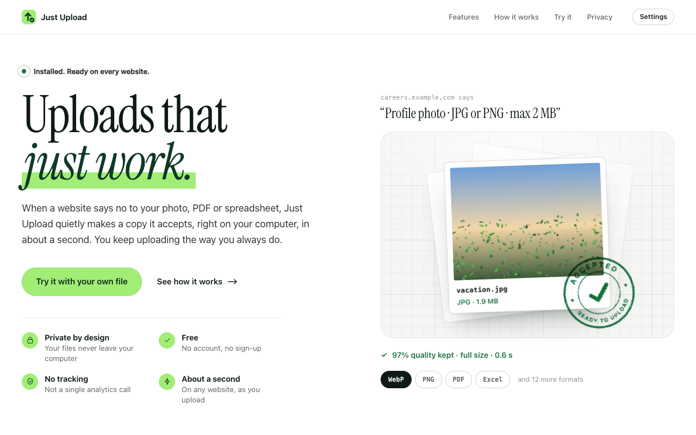
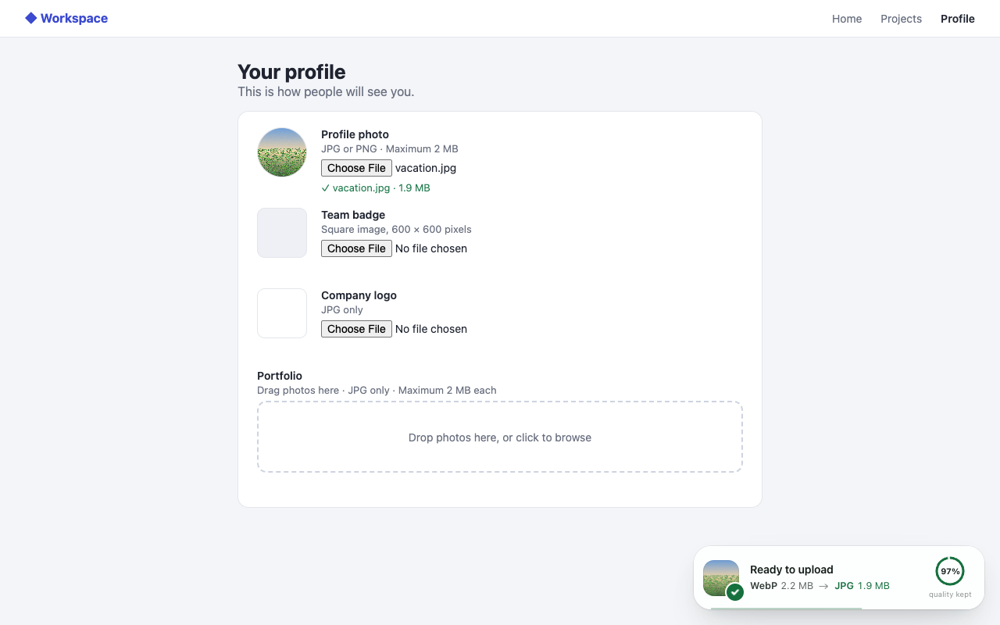
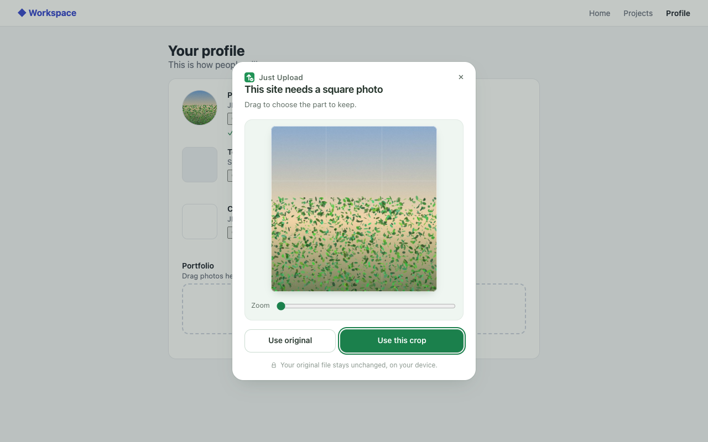

  <picture>
    <source media="(prefers-color-scheme: dark)" srcset="docs/images/banner-dark.png">
    
  </picture>

  When a website says no to your upload, Just Upload quietly fixes it, 
  privately, on your device, in about a second.

<picture>
  <source media="(prefers-color-scheme: dark)" srcset="docs/images/welcome-dark.png">
  
</picture>

## Why Just Upload

"File type not supported." "File too large." Websites are picky about what you upload.
With Just Upload you pick a file the way you always do: if the website takes it, nothing
happens; if it doesn't, Just Upload makes a copy that fits before the website sees it.

- **Private by design.** Everything happens in your browser. No servers, no account, no
  tracking.
- **Works with what you upload.** Photos, scans, PDFs and spreadsheets, in the format
  each website asks for.
- **Fits any size limit.** At full size whenever it can; it asks before using fewer
  pixels, and keeps as many as fit.
- **Reads the rules like you do.** "upto 2MB", "should not exceed 500 KB", "between 20
  and 50 KB".
- **Never a surprise.** Anything you'd notice is your choice, and your original is never
  changed.

<table>
  <tr>
    <td></td>
    <td></td>
  </tr>
  <tr>
    <td align="center">Ready in about a second</td>
    <td align="center">Asks before anything you'd notice</td>
  </tr>
</table>

## Get it

Coming soon to the Chrome Web Store.

## Privacy

Your files never leave your computer. Just Upload has no servers, collects nothing and
works offline. Read the [privacy policy](docs/privacy-policy.md).

## Support

Questions or problems: **mokshbuilds@gmail.com**. In the extension, Settings → Problems
makes a short report you can send.

## License

© 2026 Moksh Shah. All rights reserved: see [LICENSE](LICENSE). Third-party components
keep their own licenses: see [THIRD_PARTY_NOTICES.md](THIRD_PARTY_NOTICES.md).
